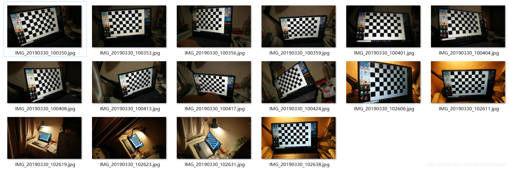
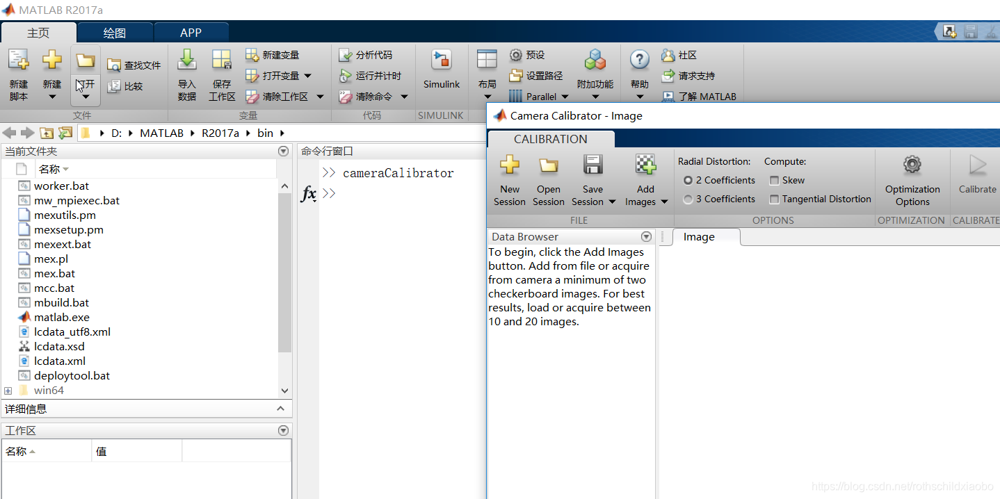
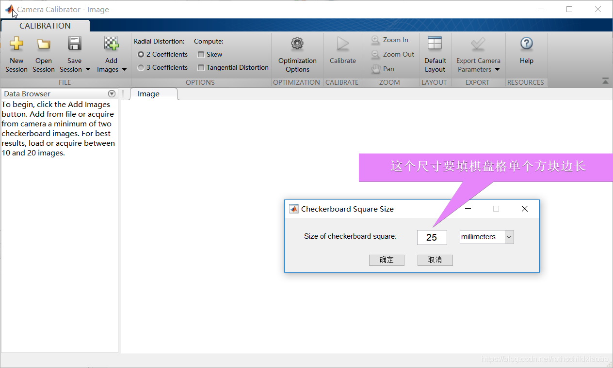
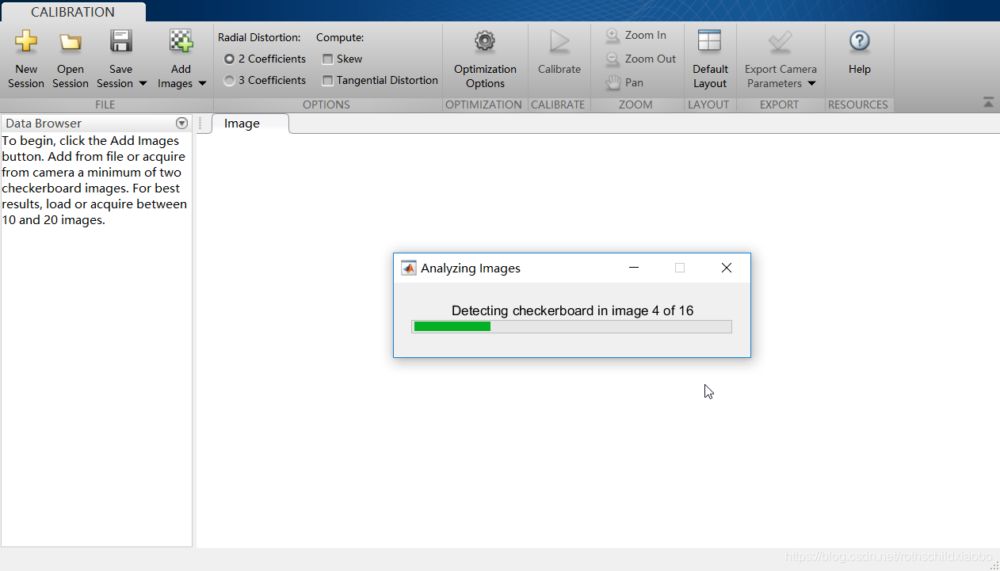
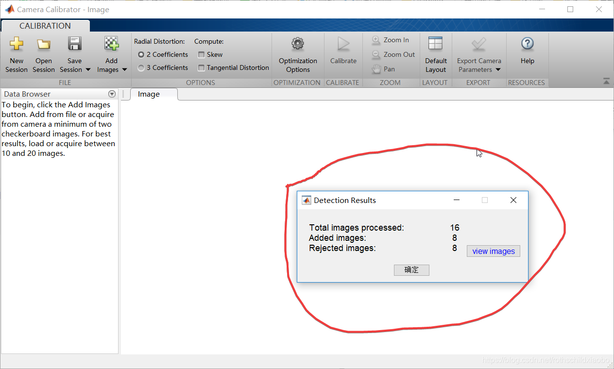
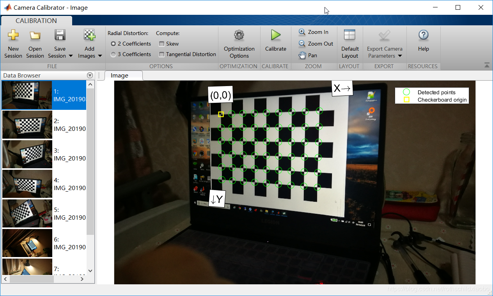
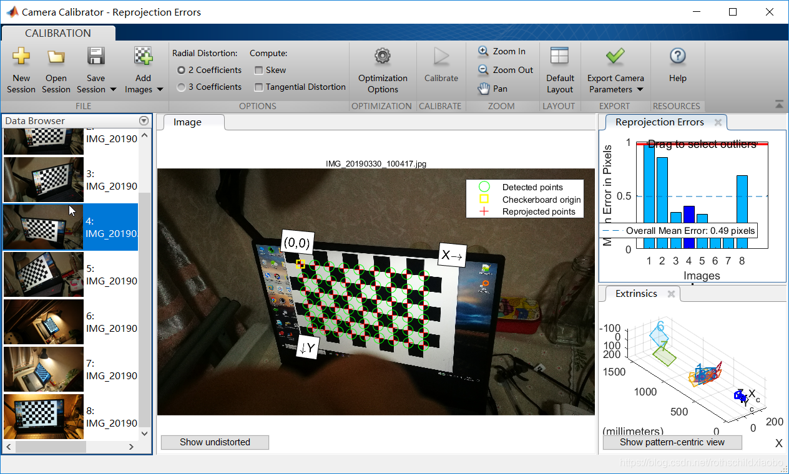

# 摄像机标定
* 本文目的在于记录对相机进行径向及切向畸变的简单标定方法*
> 计算机视觉进行检测识别前均需对相机进行标定。本文简单介绍了通过Matlab  中的cameraCalibrator工具对摄像机进行简单径向畸变和切向畸变的标定，获取相机三个径向畸变参数 k1,k2,k3 及两个切向畸变参数p1,p2 。这五个参数可在后续opencv 图像校正中进行使用。

###  图像采集
首先在opencv官网下载棋盘格图像进行打印。图像地址为
https://docs.opencv.org/2.4/_downloads/pattern.png

通过用相机对显示器上的棋盘格进行多角度拍摄保存，并量取棋盘格单个方块的边长（后续会用到）

### Matlab cameraCalibrator进行图像标定
首先打开Matlab ，在命令行输入cameracalibrator  打开标定工具

在CameraCalibrator左上角点击Add image 添加相机拍摄好的照片（不可添加不同相机的照片）CameraCalibrator 会对图片分辨率及照片中棋盘格图像进行识别，分辨率j不适合及棋盘格识别不合格的图片会被剔除不能导入

导入中...

总共添加16张图片添加成功8张，失败8张（可能是由于棋盘格不清晰导致）

接下来就可以对相机进行标定了

点击上方Calibrate 即可

这一步已经对相机畸变参数进行了计算。点击右上角Export CameraParameters 即可导出。mat 文件查看
