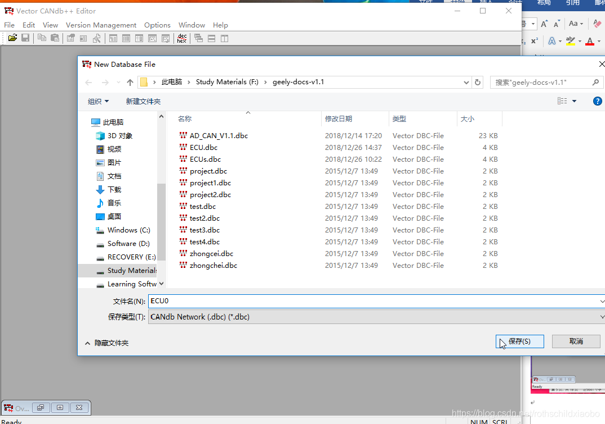

​
# CANdb++ 制作DBC文件
刚看到55号小白鸭的教程挺好的，贴上地址

[第55号小白鸭的教程](关于DBC文件的创建（DBC文件系列其一）_第55号小白鸭-CSDN博客)

一：安装好CANdb++ 软件；
二：打开CANdb++如图

创建一个dbc文件

选择格式的dbc文件

自己给dbc文件取一个名字

然后保存后自然进入这个界面

创建ACU和 CCU通信（这两个通信设备具体环境命名）

创建一个ID

根据给定的文档设定下面参数

设定周期：

添加ID：

上面设定参数用到文档：

DBC文档的一帧完成了，重复创建ID signal；完成全部文件：

添加ACU 与CCU之间的通信id和信号：双击ACU

添加相应ACU 发送ID

添加CUU请求信号
