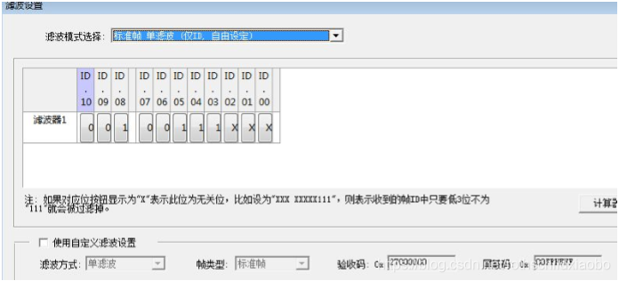

*使用 CANTest 及 CANPro 软件并选择 USBCAN-II 这个设备进行滤波时，您可能会发现和广成 科技 ECANtoools 软件简便的滤波设置有所不同，软件需要您输入一个验收码和屏蔽码，此时 需要您根据自己的需求来进行计算。下面进行举例说明。*
### 一、单 ID 滤波 
比如我们只需要一个帧 ID，比如标准帧 7E8，我们应该如何计算验收码和屏蔽码呢？答案 是依靠 CANTest 自带的滤波计算器（这个功能 CANPro 是没有的）。点击 CANTest 左上角的“滤 波设置”，进入后选择“标准帧 单滤波（设定接收单个 ID）”，填写指定的 ID，如下图所示。 这样你就得到了验收码和屏蔽码，记下来回去输入就行了，你将只会收到 ID 为 7E8 的数据。

下面解释下这东西怎么算的，对接下来计算一段滤波有帮助。先把 7E8 按照 8421 码拆开， 正好是 11111101000，把这个数中间的空格去除，再把这段数从左往右读，11111101000， 用 8421 码装回去，就变成了 FD0，这样就变成了验收码的前半段了。验收码的作用就是去和 接收到的所有帧 ID 进行比较，只有每一个位都一样才肯放过去，并显示出来。而屏蔽码则是 验收码的爸爸，假如它某一个位是 1 的话，验收码的滤波将失效。即如果屏蔽码是 0xFFFFFFFF 的话，滤波功能将完全失效，不管你验收码如何填写。

Tips：验收码和屏蔽码都是 32 位的寄存器。 

回到刚才的问题，我们肯定不希望屏蔽码这个爸爸干扰验收码的小把戏，所以从左数第 12 个位开始全都要是1，所以屏蔽码为前11位挂0，后面全是1，即000000000001111111111111 11111111，翻译过来就是 001FFFFF。验收码就不说了，要保证前面是 FD0，后面补 0，即 FD00 0000。

### 二、ID 段滤波

假如我们需要一个段的 ID，比如标准帧 138-13F（这个段是特殊的，下文会提），我们应该 如何计算呢？这相比于刚才稍显麻烦，我们首先要把 138 和 13F 进行 8421 拆分。注意要拆成 11 位的，不能弄成 12 位的。
> 138：00100111000 
13F：00100111111

对比一下发现前面都一样，后三位不一样，说明后三位我们不关心，前面弄对就行。好了， 我们得到了一串想要的数，00100111XXX，把这个数输入到 CANTest 滤波设置中的“标准帧 单 滤波（仅 ID，自由设定）”中即可。

如你所愿的得到了你需要的验收码和屏蔽码。 

那么我觉得这个段太大了怎么办，比如比如我需要标准帧 ID 为 322-325，这个段怎么计算 呢？老办法，8421 拆分。 

> 322：01100100010
   325：01100100101 

有问题了，发现了分歧，如果后三位都不管的话 326 肯定会掺进来，老办法失灵了。这个 时候需要用双滤波，即双重滤波，那我们需要的很显然是 0110010001X 和 0110010010X 这两 个组合。 

选择“标准帧 双滤波（仅 ID，自由设定）”这个选项就 OK 了，如图，你得到了你想要的 验收码和屏蔽码。

