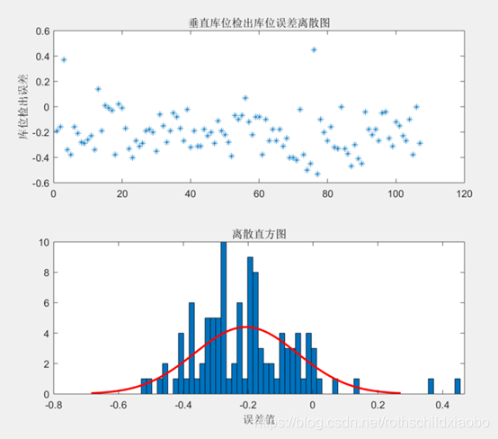

在研发测试工作中经常会有一些工程数据的处理，其中大部分数据都是符合正态分布的。为了对数据进行整理分析通常我们会求出数据的误差平均数，最大最小误差。并通过图表绘制散点图或者直方图等进行数据分析。下文记录了使用Matlab 进行数据分析图像绘制的一些代码供记录和参考

```
clc,clear,close;
% 导入数据
data = xlsread('误差数据.xlsx',1);
RealWidth = data(:,2);
DetectWidth = data(:,1);
D_Value = DetectWidth - RealWidth;

% 求 D_Value 平均值

% 绘制散点图像
subplot(2,1,1);
plot(D_Value,'*');
title('垂直库位停车后相对位置误差离散图');
ylabel('库位检出误差');
% set(gca,'YTick',[-4:0.2:2]);

% 绘制正态分布直方图
subplot(2,1,2);
histfit(D_Value,60);
title('离散直方图');
xlabel('误差值');
% ylabel('数量'); 
% set(gca,'XTick',[-4:0.2:2]);

% 拟合曲线
% f = normpdf(x,均值,标准差)
```

样图示意
> 

