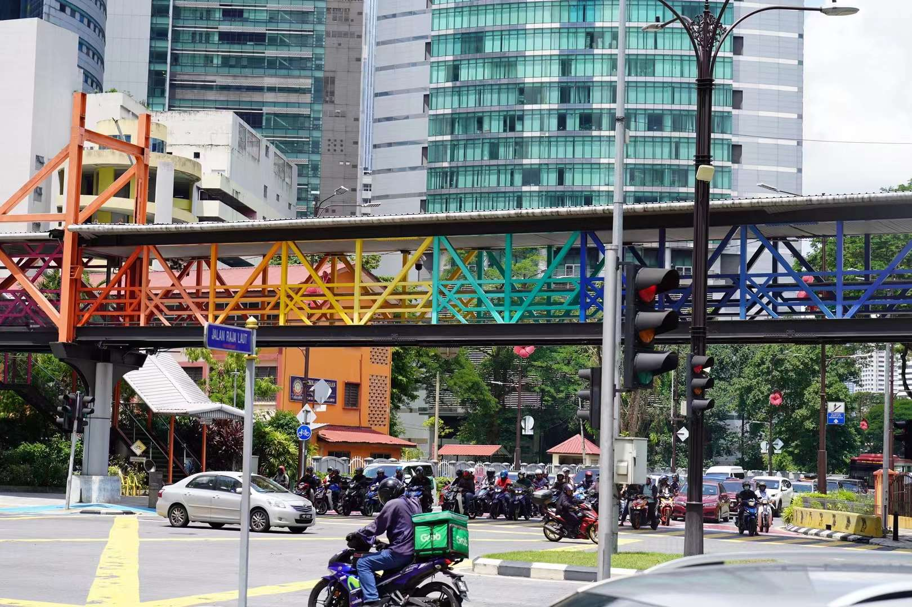
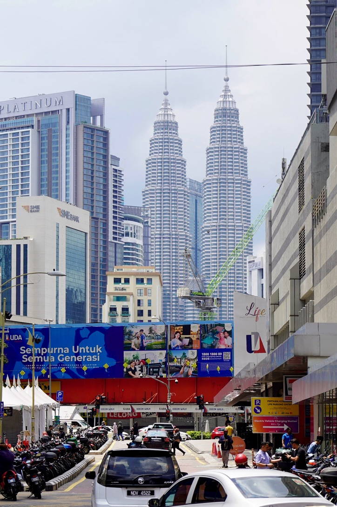
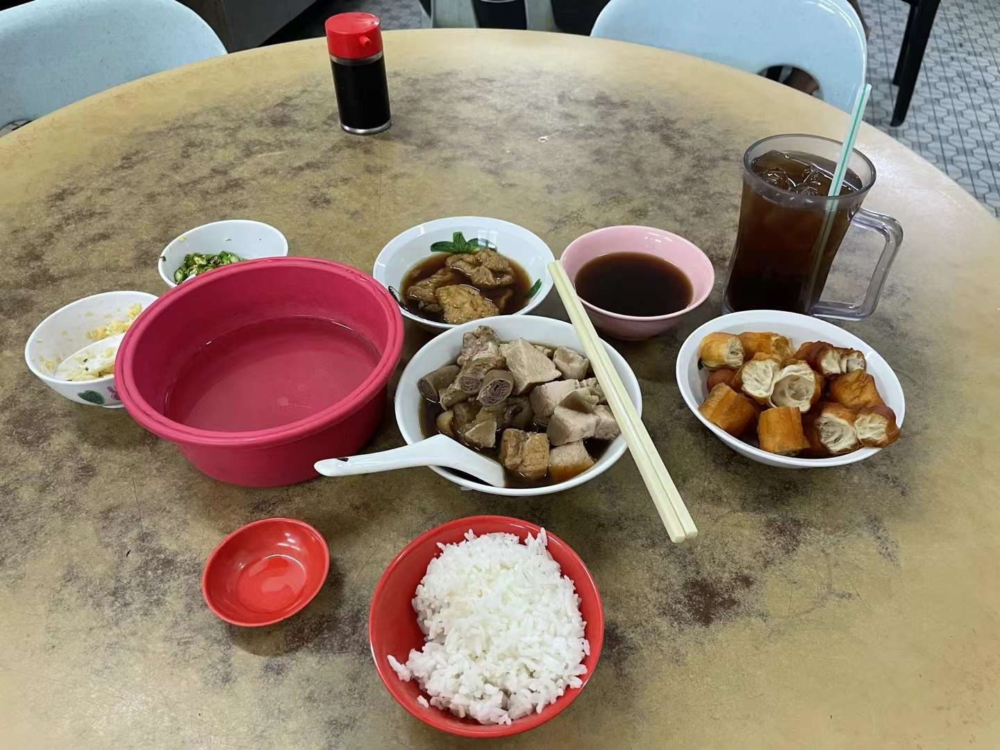

# 吉隆坡——时空联动的茨厂街和遍地清真寺

## 我就这样不停的走呀走

 到KL已经很晚了，加上有些许累就早点休息了。次日早晨才看到城市真正的面貌，出了酒店真的就是一眼东南亚。街头随便走走，提前在googlemap上标记了travel lists，看着大致方向顺着走就好了。我真的很能走路，哪里都想走着去。顺着独立广场走走，看一眼对面的占美教堂。然后就去了茨厂街随便看看，吃点东西……当天喝的几次罗汉果茶竟然觉得不错。茨厂街挺乱的，不过在记忆中和墨尔本的那个茨厂街小店招有点梦幻联动的感觉。走走走，突然下起了雨，避一避再走，一直不喜欢伞，上次去香港也是没带伞。雨来了我就躲躲，停了再走。没什么惊慌的，没伞就等雨停了再走。不要着急……

## 清真寺里避雨

忘记了怎么到的国家清真寺，反正是走走走。有路我就能走过去，体力也好，不觉得累。进清真寺要脱鞋，外边好像又要下雨了进去躲躲，没有鞋子赤脚走在地砖上足弓有些酸痛。女生进入清真寺要穿紫色罩袍，宗教礼仪，没有太多想法。只是觉得男女平等，宗教也要进步。其实罩袍也挺好看。在清真寺随便走走，外边雨越来越大，困在里边了，和朋友聊聊天，复刻了穿越时空的相似回忆。一路拍了双子塔，吉隆坡塔。打车先回酒店休息下，晚上又去双子塔下走了走看看，坐着看会喷泉。想打车回去，周五的夜晚太拥挤Grab的司机取消了订单，算了，还是走回去吧KL的旅程太长，晚上吃了肉骨茶……口味挺喜欢的，来广州不到一年，竟然这么习惯这种饮食～

