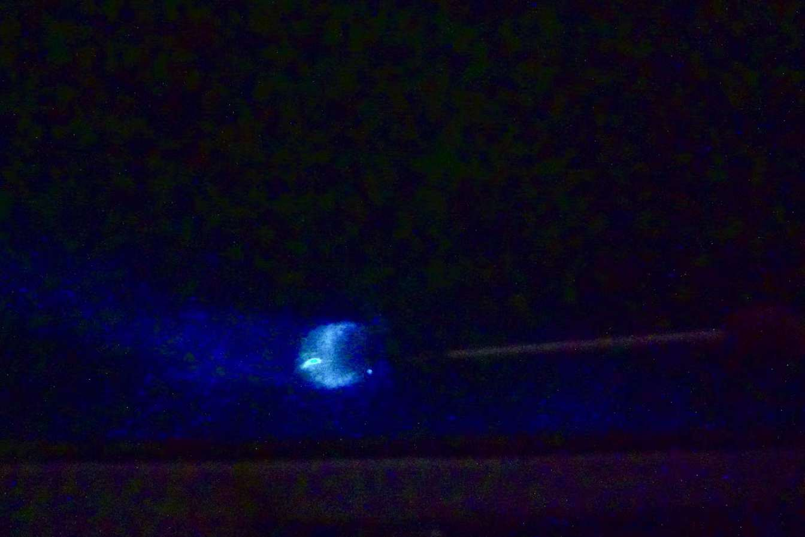

# 妈祖庙
KL市区确实没什么好玩的，去个远点的地方吧。天后宫去看看，最早关于妈祖的印象是关于厦门。好像好多地方都有天后宫，KL的应该也值得去。拜一拜香，抽个签，好像布施桶里也丢了硬币吧，祝你开心健康，祝我好运。

交通真的是个问题，现在去哪都想开车。吉隆坡租车不知道怎么样，也没带驾照，也不熟悉路。本来联系地导是想去马六甲，中午时分，消息问我要不要去萤火虫之旅。去吧，去远点的地方。跟团没有交通问题……

摸了皇家山的猴子，看了印度神庙。在瓜雪乘船出海看过海与鹰。码头旁的海鲜太贵，感觉是和旅行团有回扣吧。同行一人不喜欢吃海鲜，那刚好，我们走吧，出去看看散散步看有什么其他吃的。东南亚的乡下小镇更显安逸，若是无需工作，在这种乡下住住也很惬意吧……看看泰餐小店吃点薯条鸡排，就不要米饭了 no rice～ 吃过饭继续出海，一树一树的萤火虫没那么亮，原来还是坐在船上看。

船长大概是疯了，船开的飞快，被风吹的睁不开眼，皮肤出不得一点汗，不太舒服……从弯弯曲曲的雪兰莪河冲进大海，一人发一个网捞在海里划水捞蓝眼泪。没有意思，不喜欢捞～这样看蓝眼泪还不如去珠海海滩看海浪击打在海滩上的蓝眼泪。拍张照吧，回程休息。明天还要去马六甲
