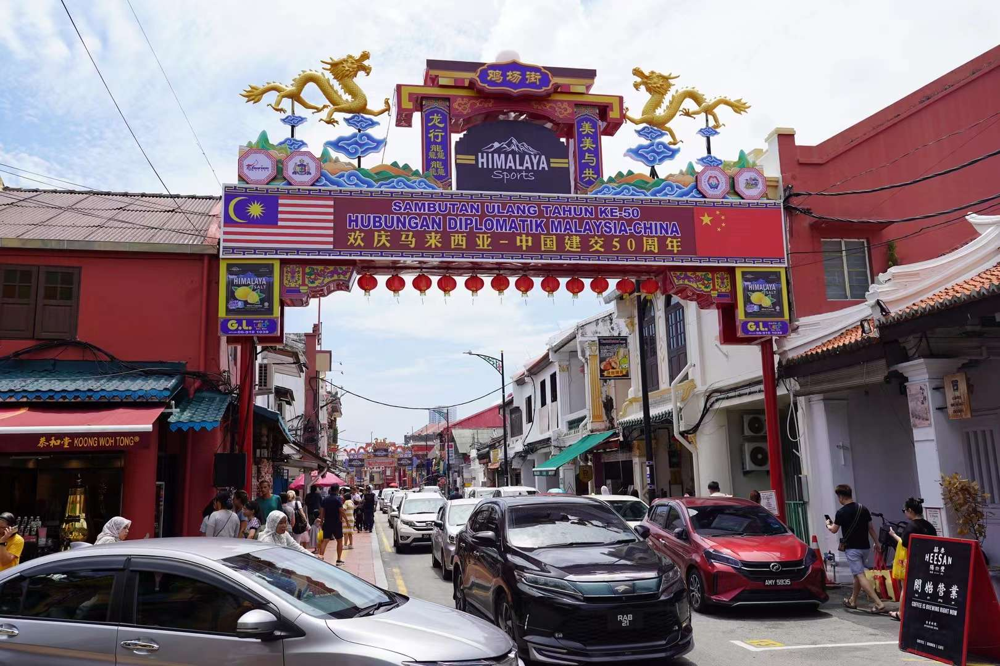
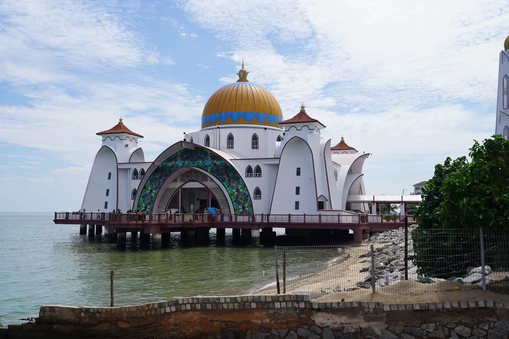
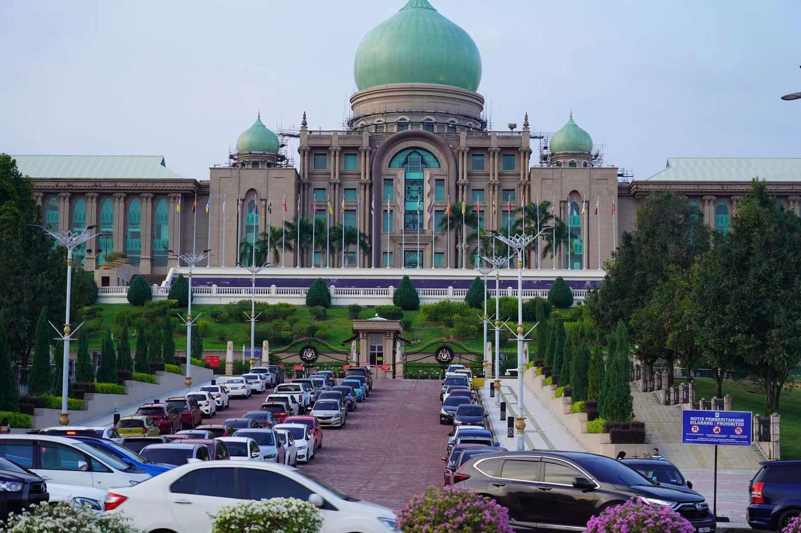
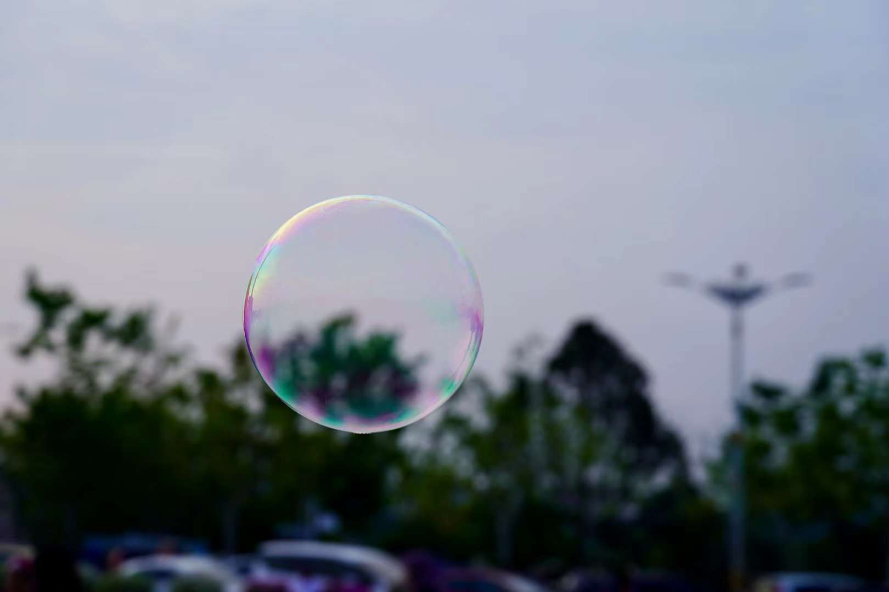
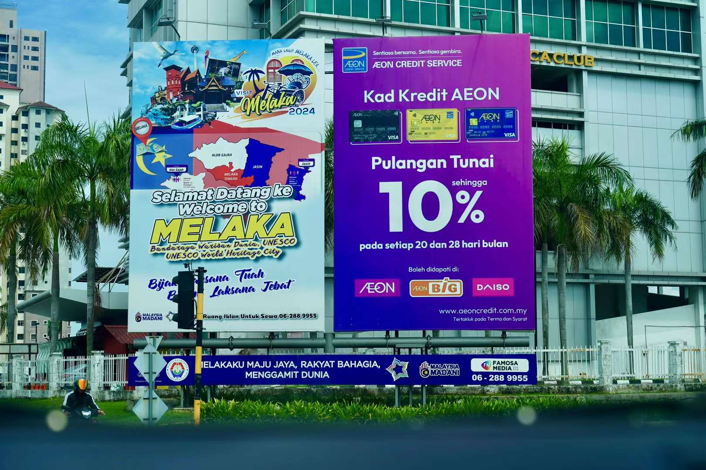

# Welcome to history city lelaka
山坡上马六甲的地名牌有种好莱坞地名牌的感觉。

郑和的船队竟然是当时全球最大的船队远超欧洲，在明朝就传播了这么多中华文化至海外。今年是中马建交50周年好像这几天也有中国军舰来吉隆坡停靠举办庆祝活动，原世界和平，中马友好。毕竟这里这么多华裔同胞讲着相同的语言传承者中华文化，应该每个国人来到马来西亚都会有一丝亲切感吧。

去布城路上看一下海上清真寺，旁边就是马六甲海峡。打开marinetraffic看一眼船舶情况，怎么感觉好像没有太多船只？

再去布城吧，周日下午堵车太严重了近三个小时才到布城。粉红清真寺刚好关门了，那就拍拍照吧.市政厅也在旁边，不对，这里是新首都，这个建筑应该算国会大楼吧……政治中心迁出重建新城，政府也真的有勇气。

小朋友在广场上玩泡泡🫧，飘在空中，真漂亮呀，如梦如幻……

